## Exploratory Data Analysis on test-set predictions by model

Box-plot of models on the 10-fold predictions on the test-set. The red line is the ensembled accuracy/MSE.

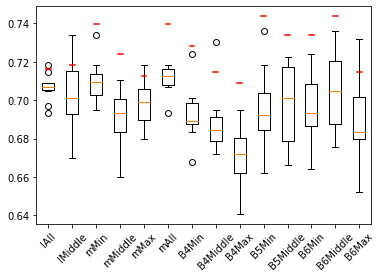  
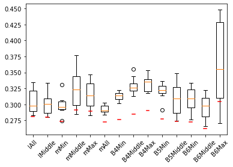

### 10-fold training - testset 10% 
| CNN-config | MSE, ACC*  |  Box plot model error summary | summary statistics |  prediction error | prediction residual | residuals misclassificaiton** |  
| -  | - | - | - | - | - | - | 
| EffNetV2 Medium, middle expo.| (0.724 0.292)   (0.724, 0.295) |  |  |   |  |    [0.5, 1.5):135, [1.5, \inf):7, sum:142 |
| EffNet B6, min expo| (0.734, 0.272)   (0.740, 0.268) |  |  | |  |    [0.5, 1.5):128, [1.5, \inf):9, sum:137 |
| EffNet B5, min expo| (0.744, 0.277)   (0.736, 0.272) | 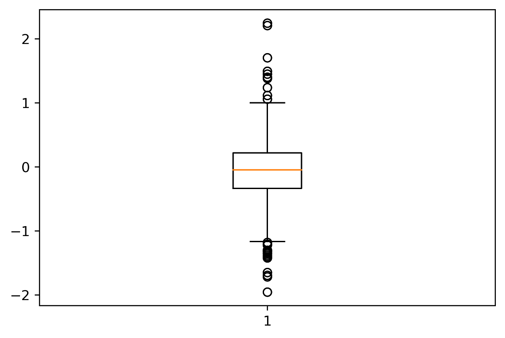 | 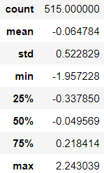 | 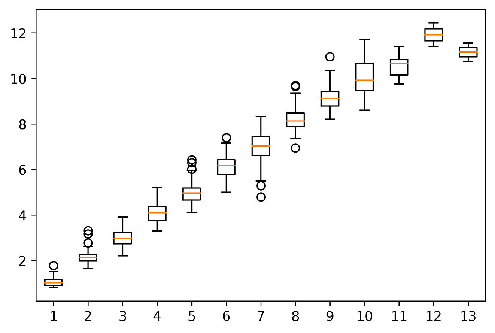|  | 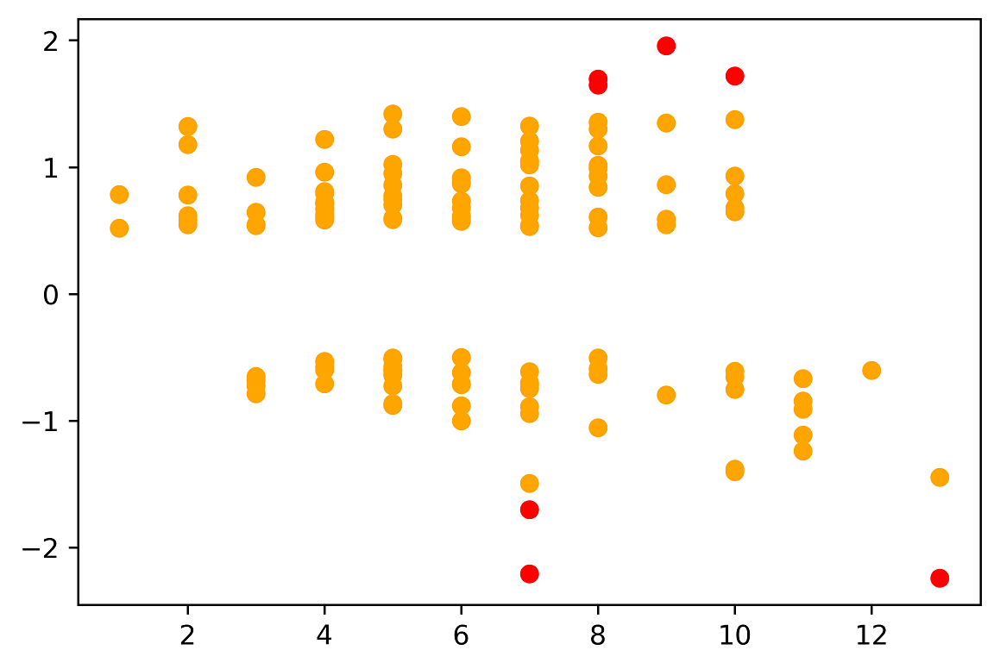   [0.5, 1.5):125, [1.5, \inf):7, sum:132 |
| EffNet B4, min expo| (0.728, 0.277)   (0.732, 0.273) | 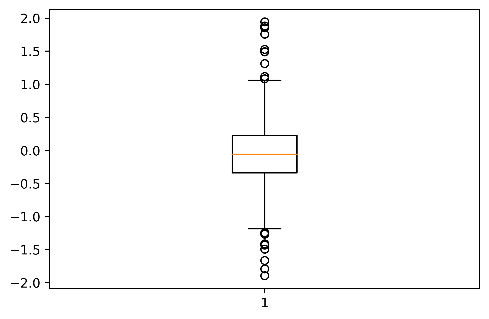 | 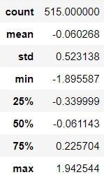 | 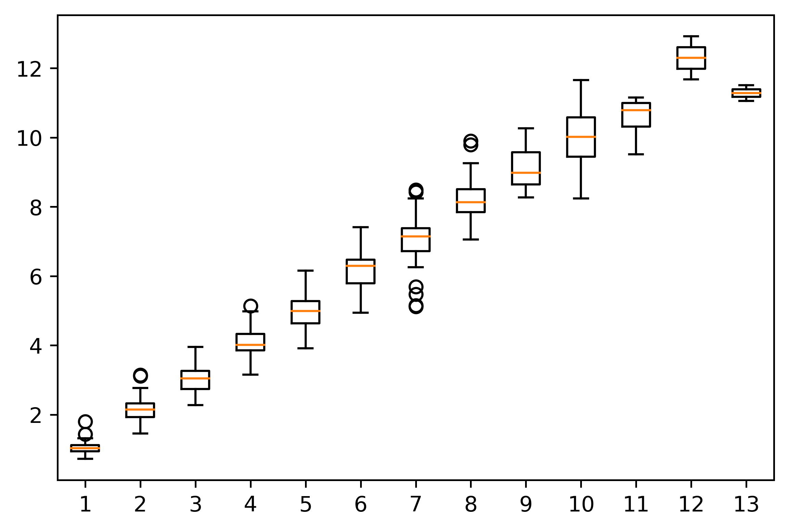| 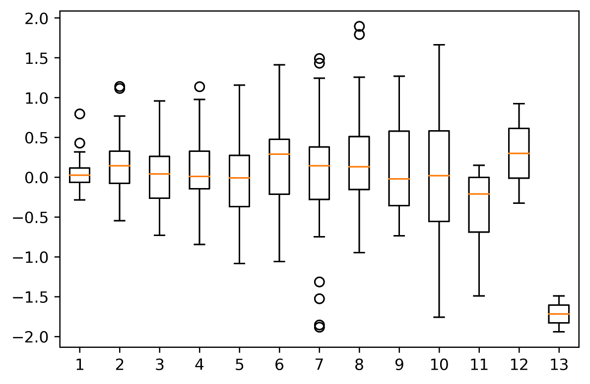 | 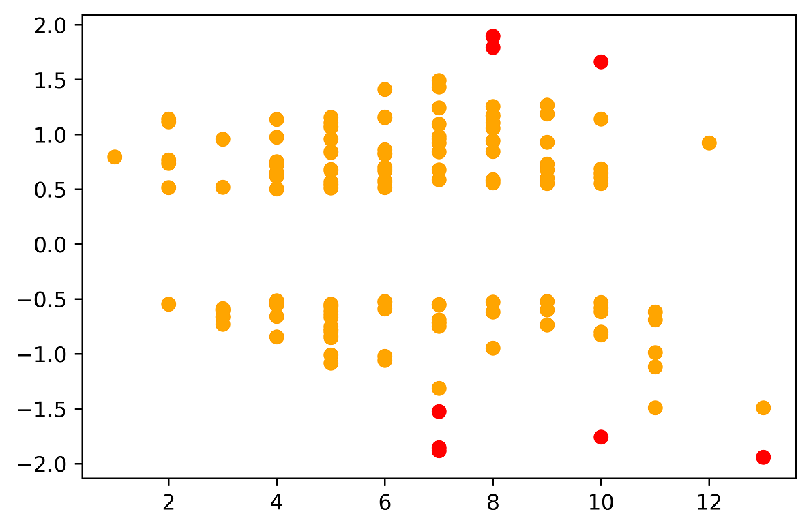   [0.5, 1.5):132, [1.5, \inf):8, sum:140 |
 
\* First 2 numbers is mean MSE, and ACCuracy across 10 models from the 10-fold split, then the second 2 numbers are mean MSE, ACCuracy across 10 models but excluding max/min predictions on each image in the test set  
\** Numbers at the bottom are errors larger than 0.5 results in a 1 year misclassification error, 1.5 results in 2 years missclassification error and so on

## Residual accuracy and standard deviation pr age for each model

|Age/CNN|   l_all |   l_middle |   m_min |   m_middle |   m_max |   m_all |   b4_min |   b4_middle |   b4_max |   b5_min |   b6_min |   b6_middle |   b6_max |
|---:|--------:|-----------:|--------:|-----------:|--------:|--------:|---------:|------------:|---------:|---------:|---------:|------------:|---------:|
|  1 |    0.11 |       0.09 |    0.13 |       0.15 |    0.16 |    0.12 |     0.04 |        0.05 |     0    |     0.07 |     0.14 |        0.1  |     0.2  |
|  2 |    0.14 |       0.12 |    0.1  |       0.14 |    0.16 |    0.13 |     0.14 |        0.11 |     0.1  |     0.17 |     0.17 |        0.12 |     0.14 |
|  3 |   -0.05 |      -0.07 |   -0.04 |      -0.03 |   -0.03 |   -0.04 |    -0.03 |       -0.07 |    -0.03 |    -0    |    -0.05 |       -0.1  |    -0.06 |
|  4 |    0.05 |       0.03 |    0.07 |       0.06 |    0.08 |    0.08 |     0.08 |        0.04 |     0.02 |     0.1  |     0.07 |        0.04 |     0.04 |
|  5 |   -0.05 |      -0.05 |    0    |      -0.02 |   -0.02 |   -0.03 |    -0.01 |       -0.04 |    -0.03 |    -0.01 |    -0.02 |       -0.05 |    -0.04 |
|  6 |    0.08 |       0.05 |    0.08 |       0.04 |    0.09 |    0.07 |     0.18 |        0.18 |     0.2  |     0.13 |     0.16 |        0.13 |     0.12 |
|  7 |   -0.1  |      -0.14 |   -0.09 |      -0.09 |   -0.04 |   -0.09 |     0.04 |        0.03 |    -0.01 |     0.02 |     0.01 |        0.01 |     0.02 |
|  8 |    0.12 |       0.11 |    0.14 |       0.11 |    0.15 |    0.13 |     0.27 |        0.21 |     0.21 |     0.25 |     0.18 |        0.23 |     0.26 |
|  9 |   -0.12 |      -0.14 |   -0.11 |      -0.14 |   -0.13 |   -0.12 |     0.11 |        0.12 |     0.07 |     0.19 |     0.12 |        0.14 |     0.11 |
| 10 |   -0.23 |      -0.24 |   -0.11 |      -0.2  |   -0.22 |   -0.19 |     0.01 |        0.05 |    -0.04 |     0.06 |    -0.1  |       -0    |    -0.02 |
| 11 |   -0.79 |      -0.83 |   -0.66 |      -0.81 |   -0.78 |   -0.7  |    -0.41 |       -0.44 |    -0.45 |    -0.43 |    -0.54 |       -0.56 |    -0.53 |
| 12 |   -0.3  |      -0.4  |   -0.29 |      -0.49 |   -0.39 |   -0.31 |     0.3  |        0.35 |    -0.06 |    -0.08 |     0.01 |       -0.11 |    -0.27 |
| 13 |   -1.91 |      -1.91 |   -1.98 |      -2.35 |   -2.19 |   -2.2  |    -1.72 |       -1.46 |    -1.58 |    -1.84 |    -1.79 |       -1.75 |    -1.75 |

### Standard deviation

|Age/CNN|   l_all |   l_middle |   m_min |   m_middle |   m_max |   m_all |   b4_min |   b4_middle |   b4_max |   b5_min |   b6_min |   b6_middle |   b6_max |
|---:|--------:|-----------:|--------:|-----------:|--------:|--------:|---------:|------------:|---------:|---------:|---------:|------------:|---------:|
|  1 |    0.26 |       0.17 |    0.21 |       0.22 |    0.22 |    0.22 |     0.2  |        0.25 |     0.3  |     0.21 |     0.22 |        0.19 |     0.73 |
|  2 |    0.27 |       0.27 |    0.29 |       0.29 |    0.28 |    0.27 |     0.33 |        0.32 |     0.34 |     0.31 |     0.31 |        0.3  |     0.29 |
|  3 |    0.39 |       0.4  |    0.41 |       0.43 |    0.4  |    0.43 |     0.37 |        0.41 |     0.42 |     0.38 |     0.37 |        0.36 |     0.37 |
|  4 |    0.4  |       0.41 |    0.41 |       0.41 |    0.43 |    0.41 |     0.39 |        0.43 |     0.43 |     0.43 |     0.41 |        0.43 |     0.42 |
|  5 |    0.47 |       0.47 |    0.46 |       0.47 |    0.48 |    0.46 |     0.49 |        0.51 |     0.48 |     0.46 |     0.5  |        0.5  |     0.5  |
|  6 |    0.47 |       0.47 |    0.5  |       0.51 |    0.51 |    0.47 |     0.52 |        0.53 |     0.5  |     0.5  |     0.53 |        0.5  |     0.48 |
|  7 |    0.66 |       0.63 |    0.64 |       0.64 |    0.64 |    0.63 |     0.71 |        0.68 |     0.7  |     0.7  |     0.63 |        0.65 |     0.65 |
|  8 |    0.65 |       0.66 |    0.64 |       0.69 |    0.67 |    0.65 |     0.59 |        0.64 |     0.67 |     0.59 |     0.56 |        0.57 |     0.57 |
|  9 |    0.65 |       0.68 |    0.62 |       0.57 |    0.58 |    0.56 |     0.58 |        0.63 |     0.63 |     0.6  |     0.6  |        0.64 |     0.62 |
| 10 |    0.71 |       0.68 |    0.77 |       0.73 |    0.77 |    0.76 |     0.79 |        0.69 |     0.74 |     0.82 |     0.78 |        0.69 |     0.67 |
| 11 |    0.52 |       0.53 |    0.48 |       0.46 |    0.44 |    0.46 |     0.51 |        0.5  |     0.54 |     0.49 |     0.56 |        0.44 |     0.47 |
| 12 |    0.6  |       0.71 |    0.49 |       0.36 |    0.51 |    0.51 |     0.62 |        0.98 |     0.91 |     0.53 |     0.18 |        0.38 |     0.59 |
| 13 |    0.49 |       0.47 |    0.33 |       0.3  |    0.34 |    0.33 |     0.23 |        0.29 |     0.15 |     0.4  |     0.51 |        0.41 |     0.51 |

## Outliers

Outliers with an error of more than 1.5 years:
| V2-m,mid. | V2-l,all | V2-l,mid. | B4,min | B5,min |  B6,min | B6,mid. |
|-----------|----------|-----------|--------|--------|---------|---------|
|           |          |           | 13     | 13     | 13      | 13      |
|           |          |           |        |        | 48      |         |
| 71        | 71       | 71        | 71     | 71     | 71      | 71      |
| 92        |          |           |        |        |         |         |
|           |          |           | 270    | 270    |         | 270     |
| 279       | 279      | 279       | 279    | 279    | 279     | 279     |
|           | 312      | 312       |        |        |         |         |
|           |          | 320       | 320    |        |         |         |
| 362       | 362      | 362       | 362    | 362    | 362     | 362     |
| 342       | 342      | 342       | 342    | 342    | 342     | 342     |
| 369       | 369      | 369       | 369    |        | 369     | 369     |
|           |          | 393       |        |        | 393     | 393     |
| 423       | 423      | 423       |        |        |         |         |
|           |          |           |        | 444    |         |         |
|           |          |           |        |        | 502     | 502     |
|           |          |           |        |        |         |         |
| 7         | 7        | 9         | 8      | 7      | 9       | 9       |

## Largest outliers with predictions and ground-truth
| Idx | V2-m,mid. | V2-l,all | V2-l,mid. | B4,min | B5,min |  B6,min | B6,mid. | Age  |
|-----|-----------|----------|-----------|--------|--------|---------|---------|------|
| 13  |           |          |           | 9.79   | 9.64   | 9.74    | 9.58    | 8    |
| 48  |           |          |           |        |        | 7.6     |         | 6    |
| 71  | 4.96      | 4.98     | 4.94      | 5.14   | 4.79   | 5.06    | 5.12    | 7    |
| 92  | 10.95     |          |           |        |        |         |         | 13   |
| 270 |           |          |           | 11.66  | 11.71  |         | 11.53   | 10   |
| 279 | 9.93      | 9.79     | 9.75      | 9.89   | 9.69   | 9.67    | 9.7     | 8    |
| 312 |           | 9.42     | 9.38      |        |        |         |         | 11   |
| 320 |           |          | 5.44      | 5.47   |        |         |         | 7    |
| 362 | 5.11      | 5.14     | 5.23      | 5.11   | 5.29   | 5.24    | 5.15    | 7    |
| 342 | 10.35     | 10.6     | 10.61     | 11.05  | 10.75  | 10.69   | 10.84   | 13   |
| 369 | 8.17      | 8.13     | 8.23      | 8.24   |        | 7.85    | 8.29    | 10   |
| 393 |           |          | 10.53     |        |        | 10.75   | 10.83   | 9    |
| 423 | 5.39      | 5.69     | 5.43      |        |        |         |         | 8    |
| 444 |           |          |           |        | 10.95  |         |         | 9    |
| 502 |           |          |           |        |        | 9.4     | 9.43    | 11   |

## Images of most common outliers: {13, 71, 270, 342, 360, 369}

| Index | 13 | 71 | 270 | 342 | 360 | 269 |
| - | - | - | - | - | - | - |
| Image |  |  |  |  |  |  |

