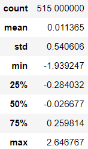
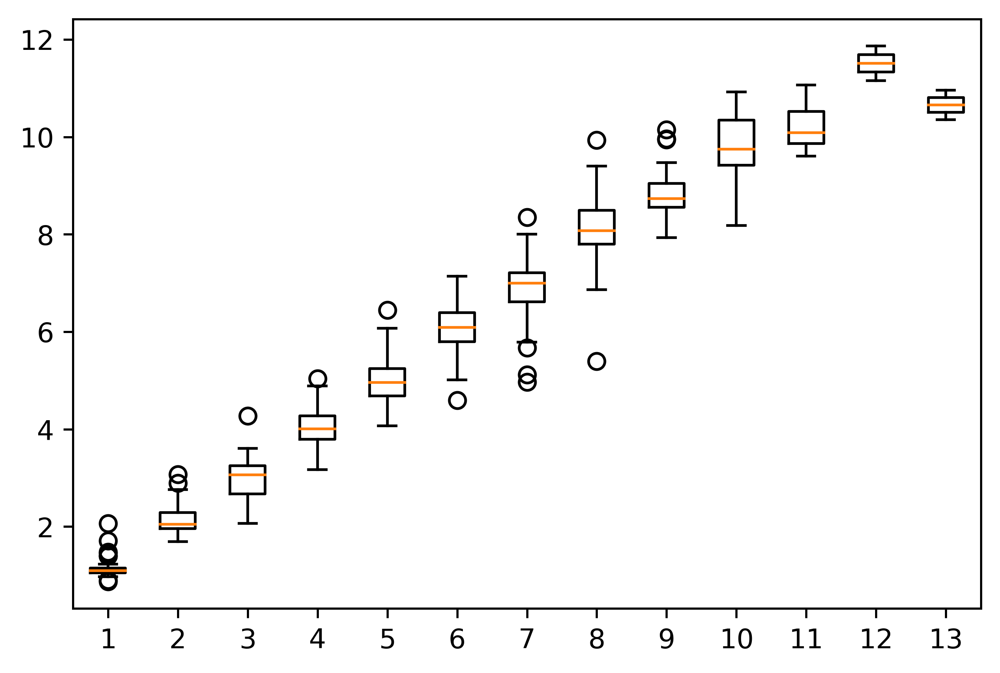
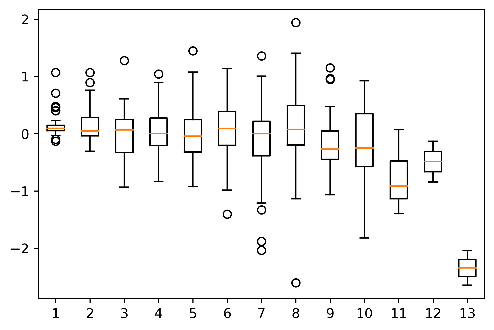
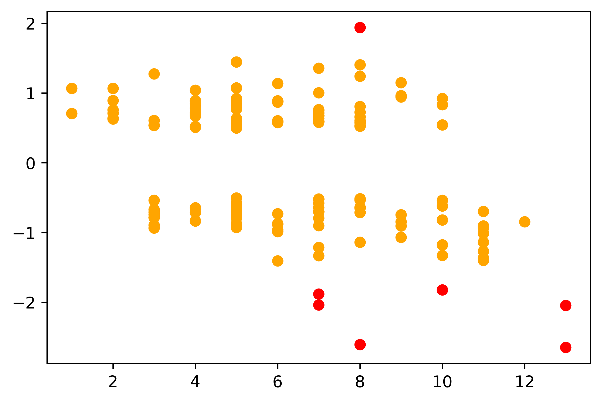
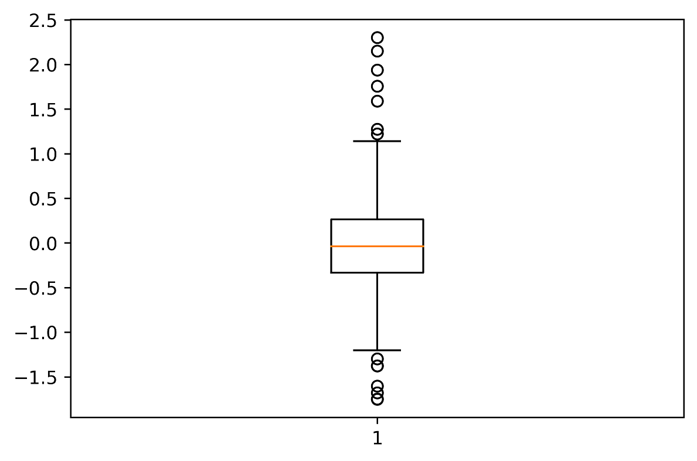
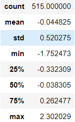
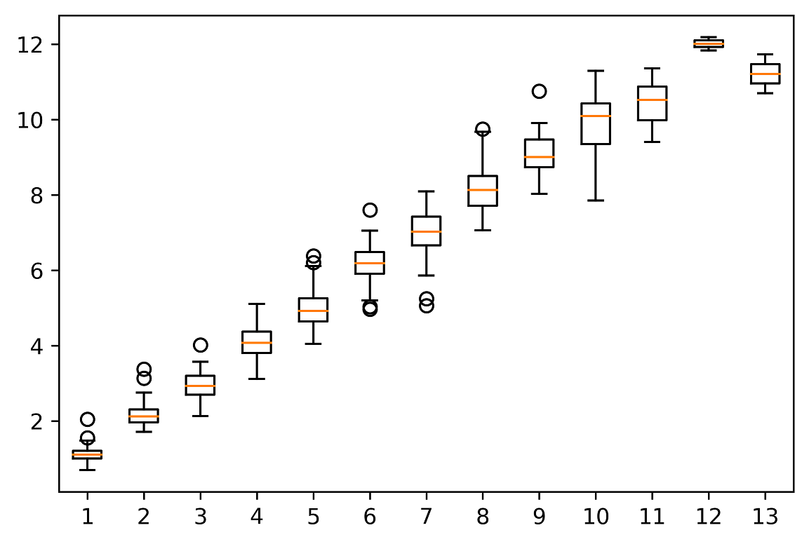
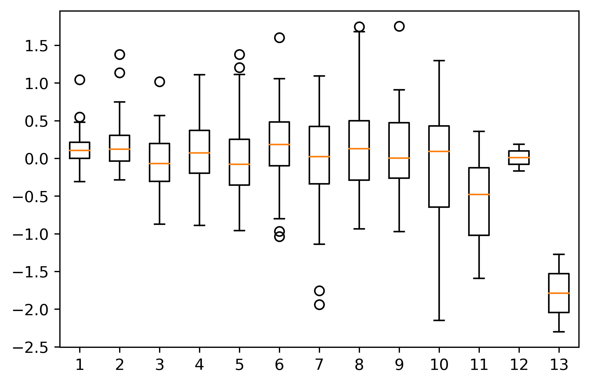
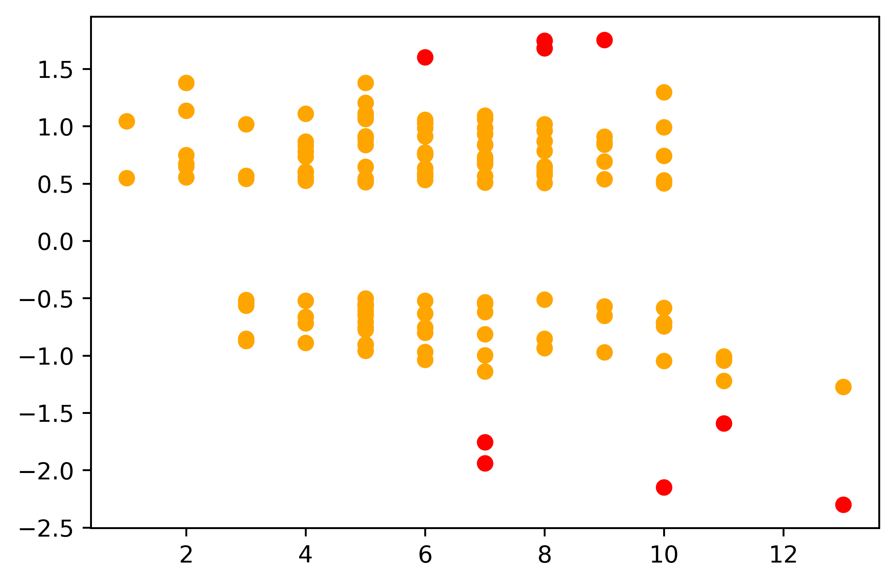

## Exploratory Data Analysis on test-set predictions by the models

### 10-fold training - testset 10% 
| CNN-config | MSE, ACC*  | MSE, ACC** | model error | summary statistics |  pred. error | pred. residuals | residuals misclassificaiton | residual class s.t. rounding error *** |
| - | - | - | - | - | - | - | - | - | 
| EffNetV2 Medium, middle expo.| 0.724  0.292 | 0.724  0.295 |  |  |   |  | | [0.5, 1.5):135   [1.5, \inf):7   sum:142 |
| EffNet B6, min expo| 0.734  0.272 | 0.740  0.268 |  |  | |  |  | [0.5, 1.5):135   [1.5, \inf):7   sum:137 |
 
\* Mean MSE, and ACCuracy across 10 models from the 10-fold split  
\** Mean MSE, ACCuracy across 10 models but excluding max/min predictions on each image in the test set
\*** errors larger than 0.5 results in a 1 year misclassification error, 1.5 results in 2 years missclassification error and so on
